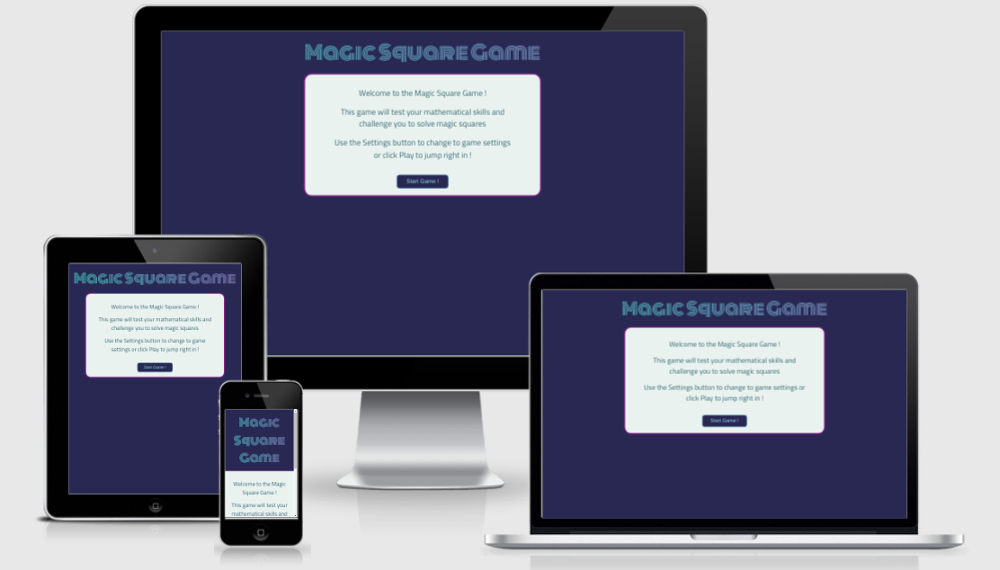

# Magic Square Game

## To Do:

- Add variable hints (eg. 1,2,3 hints)
- Fix the footer issue; need footer for fade in
- Resize the hint boxes
- Create image for showing players how to play
- Complete and document the testing
- Complete the Readme.md

## Objective

- Create a magic square game where the user completes a magic square with a number of cells missing
- The game should allow the user to select the difficulty and sie of the magic square
- If the user is stuck, the game should provide a hint to the user
- The game should also track the score of the game

## Objective

A magic square of length and height of `root` n can be constructed using an array of length `n` of integers increasing by a constant `k`

In order to randomly generate a magic square, the following inputs are required:

- A sequence of n integers, with a fixed difference k between subsequent integers
- An algorithm for completing the magic square 

The De la Loubère (or siamese) method is proposed as the algorithm for completing the magic square.

- Wikipedia page for Magic Squares: [link](https://en.wikipedia.org/wiki/Magic_square) 
- MathLab paper on Magic Squares: [link](https://www.mathworks.com/content/dam/mathworks/mathworks-dot-com/moler/exm/chapters/magic.pdf)
- Wikipedia page on the De la Loubère method" [link](https://en.wikipedia.org/wiki/Siamese_method)

### User stories

As a site user:

- I want to ................

As a site owner:

- I want to ................

## Wireframes

[Intro Page](https://wireframe.cc/oG2XvV)

[Game page](https://wireframe.cc/FEA7MX)

## Features 

Overview of the site features:

### Existing Features

- __Feature 1__

  - Overview of feature 1

### Features Left to Implement

- Another feature idea

## Testing 

Description of testing

### Validator Testing 

- HTML
    - Results of running the site through the official [W3C validator](https://validator.w3.org/) 
- CSS
    - No errors were found when passing through the official [(Jigsaw) validator](https://jigsaw.w3.org/css-validator/validator?uri=https%3A%2F%2Fvalidator.w3.org%2Fnu%2F%3Fdoc%3Dhttps%253A%252F%252Fcode-institute-org.github.io%252Flove-maths%252F&profile=css3svg&usermedium=all&warning=1&vextwarning=&lang=en)
- JavaScript
    - No errors were found when passing through the official [Jshint validator](https://jshint.com/)
      - Include metrics on the Jshint validator: 

### Unfixed Bugs

Description of unfixed / known bugs 

## Deployment

Link to live deployment on GitHub pages

## Attribution 

- The following guide was used to create the text gradients [link](https://fossheim.io/writing/posts/css-text-gradient/)
- The following StackOverFlow post was used to help implement the fadeIn and fadeOut functionality of the `container-intro` div: [link](https://stackoverflow.com/questions/12584481/simple-fade-in-fade-out-div-with-jquery-on-click)
- Sample code was leveraged from the following CodePen example to create the animated gradient for the title [link](https://codepen.io/bsander/pen/pPpbNm?editors=1100)

### Content 

- The text for the Home page was taken from Wikipedia Article A
- Instructions on how to implement form validation on the Sign Up page was taken from [Specific YouTube Tutorial](https://www.youtube.com/)
- The icons in the footer were taken from [Font Awesome](https://fontawesome.com/)

### Media
Links to Media that were used for the site:

- The photos used on the home and sign up page are from This Open Source site
- The images used for the gallery page were taken from this other open source site

Congratulations on completing your Readme, you have made another big stride in the direction of being a developer! 

## Other General Project Advice

Below you will find a couple of extra tips that may be helpful when completing your project. Remember that each of these projects will become part of your final portfolio so it’s important to allow enough time to showcase your best work! 

- One of the most basic elements of keeping a healthy commit history is with the commit message. When getting started with your project, read through [this article](https://chris.beams.io/posts/git-commit/) by Chris Beams on How to Write  a Git Commit Message 
  - Make sure to keep the messages in the imperative mood 

- When naming the files in your project directory, make sure to consider meaningful naming of files, point to specific names and sections of content.
  - For example, instead of naming an image used ‘image1.png’ consider naming it ‘landing_page_img.png’. This will ensure that there are clear file paths kept. 

- Do some extra research on good and bad coding practices, there are a handful of useful articles to read, consider reviewing the following list when getting started:
  - [Writing Your Best Code](https://learn.shayhowe.com/html-css/writing-your-best-code/)
  - [HTML & CSS Coding Best Practices](https://medium.com/@inceptiondj.info/html-css-coding-best-practice-fadb9870a00f)
  - [Google HTML/CSS Style Guide](https://google.github.io/styleguide/htmlcssguide.html#General)

Getting started with your Portfolio Projects can be daunting, planning your project can make it a lot easier to tackle, take small steps to reach the final outcome and enjoy the process! 

- - - 

## Development

### Languages
- HTML
- CSS
- JavaScript
- jQuery

### Tools / Technologies

- **[VScode](https://code.visualstudio.com/)**  
All coding was completed in VS Code.

- **[cdnjs][https://cdnjs.com/libraries/jquery]**
cdnjs was used as the reference for the jQuery JavaScript library.

- **[coolors.co](https://coolors.co/)**  
Potential site palettes were tested with Coolors.  

- **[gauger.io](https://gauger.io/fonticon/)**  
This website was used to generate the favicon using an icon from Font Awesome.

- **[Am I Responsive?](http://ami.responsivedesign.is/)**  
For rendering the device preview image

- **[https://ecotrust-canada.github.io/](https://ecotrust-canada.github.io/markdown-toc/)**  
For generating the nicely formatted markdown table of contents

- - - 